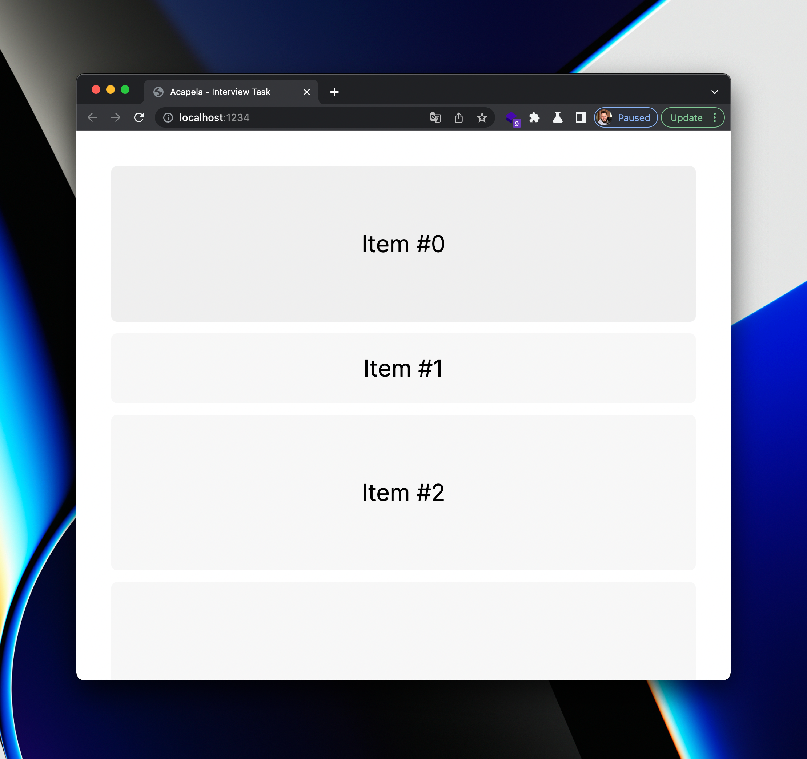

## Acapela interview task

Welcome! Thank you for taking part in our interview process. We hope it'll be good and valuable experience for both of us, where we can learn from each other.

### The goal

The idea is to see how you'll solve problem that might seem simple on the surface, but has quite some quirks under the hood.

### The task

Before you start, clone this repo, call `yarn install` and `yarn dev` to have visual overview.

The App contains feed with multiple items, where each of them can have various height.

Height of each item can also be dynamic and changed for any reason not-known in advance. (eg. item, when clicked, doubles its height, but height can also change as a result of resizing the window, etc)

The goal is to watch which item is 'the most visible on the screen' and highlight it.

Requirements:

- only one item can be highlighted at most at any time
- if 2+ items are fully visible at any moment, the one that is 'the most central' on the screen is considered 'the most visible'
- if item is resized for any reason (eg. window resize) - highlighted item should be correctly updated if needed
- if some item was highlighted, but later no item is visible anymore (eg. page has large bottom padding, so you can scroll to the bottom making no items visible) - no item should be highlighted

Additional design / architecture insights:

- if needed, we should be able to have multiple, fully independent groups of such items. eg. we could have 2 feeds side by side (each independently scrollable), and each of them would have 'one most visible item'
- (nice to have) visibility threshold should be configurable (eg. ignore items that are only 20% visible)
- the API should be as composable as possible (meaning it is possible to add 'new group' with minimal boilerplate)
- ideally - the API should not be 'leaking' implementation details to parent components, etc as much as possible

- (extreme nice-to-have): handling list scrolled all the way to the top/bottom
  If list is scrolled all the way to the top, first item is certainly not 'the most central' (as items below are). Thus first item would never be 'the most visible'. What we can do is consider this, and adjust it so we somehow still highlight all the items at least for a short period at some point

Thanks! Good luck!
